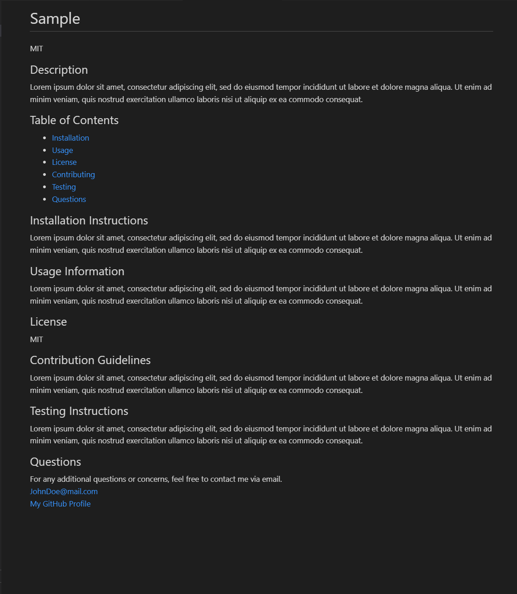

# Potential Enigma

## About this App

### Description

Potential Enigma is a command-line application that accepts user input in order to generate a high-quality README.md file for your web development project.

### User Story

As a web developer looking for a way to create a high quiality README.md file, I would like an application that accepts my user input to generate a sleek Markdown file. When I run the application, I am presented with a series of prompts that ask me for information regarding the project I am working on. Once the prompts have been answered, I can view my generated README.md file in the dist folder of my project.

### Features

* The README.md file comes fully equiped with areas for the description, installation instructions, usage information, licensing, contribution guidelines, and testing instructions.
* There is a section for your GitHub profile and email address incase users wish to contact you about your project.
* Also includeded is a fully functional table of contents, that takes your users to the corresponding section in your generated README.md file.

## Installation

In order to run this program you will need to:

* Clone this repository to receive all the files.

## Requirements

- Code editor (Visual Studio Code is reccomended)
- Command line terminal (GitBash, PowerShell, Terminal, etc.)
- Most recent version of Node.JS
- Clone the Potential Enigma project file onto your machine

## How to Use

After gathering the necessary tools mentioned above, open the Potential Enigma project folder in your code editor. At this time, open your command line terminal and navigate to the root directory for Potential Enigma. Once you are in the root directory run the following command in your command line: node index.js. This command will begin a series of prompts. Once you have answered all of the prompts, your README.md file will be generated and stored in the "dist" folder located in the root directory for Potential Enigma.
 
 
Please refer to this video for additional help on getting started:

<a href="https://www.youtube.com/watch?v=lLnsE5pB2cg" target="_blank">Demonstration Video</a>

## Sample README.md:

## Contributions

Caleb Funderburk
